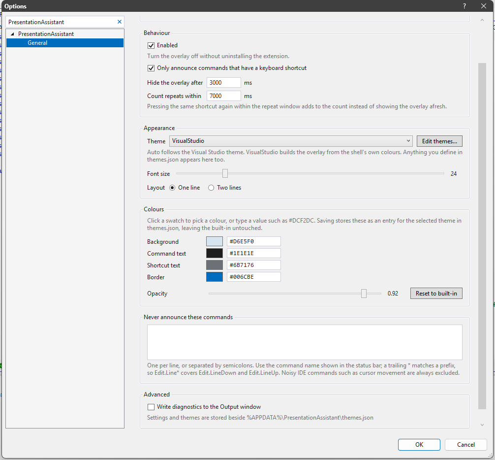

# PresentationAssistant

A Visual Studio extension that announces the command you just ran, and the keyboard
shortcut that runs it, in a small overlay just above the status bar.

Useful when you are screen sharing, recording a demo, pairing, teaching — or just trying
to learn your own key bindings.


## Contents

- [What you see](#what-you-see)
- [Installing](#installing)
- [Requirements](#requirements)
- [Options](#options)
- [Excluding commands](#excluding-commands)
- [Themes](#themes)
- [Custom themes](#custom-themes)
- [Where things are stored](#where-things-are-stored)
- [Building from source](#building-from-source)
- [Versioning](#versioning)
- [Tests](#tests)
- [How it works](#how-it-works)
- [Project layout](#project-layout)

## What you see


```
Scroll Line Down via Ctrl+Down Arrow ×9
└──────┬──────┘     └──────┬──────┘  └┬┘
   command          key binding    repeat count
```

- **Command** — the command's display name, in bold. The full command id goes to the
  status bar as `PA: Edit.ScrollLineDown via Ctrl+Down Arrow`, which is also the form to
  use in [Excluded Commands](#excluding-commands).
- **Key binding** — every shortcut bound to the command. If there is more than one they
  are joined with `or`. Commands with no binding still appear, unless you turn on
  [Shortcuts Only](#options).
- **Repeat count** — holding a key down, or pressing the same shortcut repeatedly, does
  not flash the overlay once per keystroke. Consecutive invocations of the same command
  collapse into one line with a `×N` counter. A run ends when a different command is
  invoked, or when **Multiplier Timeout** elapses between two keystrokes.

The overlay never takes focus, never appears in Alt+Tab or the taskbar, and hides itself
after **Window Timeout**.

## Installing

From the [Visual Studio Marketplace](https://marketplace.visualstudio.com/items?itemName=LokeshGovindu.PresentationAssistant),
or by double-clicking a `PresentationAssistant.vsix` built from source.

There is nothing to switch on afterwards — the extension loads with the IDE and starts
announcing commands immediately.

## Requirements

| | |
| --- | --- |
| Visual Studio | 2022 (17.x) or 2026 (18.x), `amd64` |
| .NET Framework | 4.7.2 |

Both are supported by the same VSIX — the manifest's `InstallationTarget` is
`[17.0, 19.0)`.

## Options

**Tools → Options → PresentationAssistant → General**, which previews the overlay live as
you change it:


Scrolling down reaches the colours, the exclusion list and the diagnostics switch:



| Setting | Default | Meaning |
| --- | --- | --- |
| **Enabled** | `true` | Master switch. Turns the overlay off without uninstalling the extension. |
| **Only announce commands that have a keyboard shortcut** | `false` | Hides commands with no key binding. |
| **Hide the overlay after** | `5000` ms | How long the overlay stays on screen after the last command. |
| **Count repeats within** | `10000` ms | Largest gap between two presses that still count towards the same `×N` run. |
| **Theme** | `VisualStudio` | Overlay palette — see [below](#themes). |
| **Font size** | `24` | Overlay text size, 8 to 96. |
| **Layout** | One line | One line, or the shortcut stacked under the command name. |
| **Colours** | from the theme | The four colours and the opacity of the selected theme — see [below](#custom-themes). |
| **Excluded commands** | empty | Commands never to announce — see [below](#excluding-commands). |
| **Diagnostics** | `false` | Log what the extension is doing to a PresentationAssistant pane in the Output window. |

Changes apply immediately; there is no need to restart the IDE. Timeouts and font size are
clamped to sane ranges, so a stray value cannot leave the overlay stuck on screen.

## Excluding commands

Some commands are just noise — whatever you happen to hold down, or whatever your own
setup fires constantly. List them in **Excluded Commands**, separated by semicolons:

```
Edit.Line*; View.Output; File.SaveAll
```

- Patterns match the command id shown in the status bar, e.g. `Edit.ScrollLineDown`.
- A trailing `*` matches a prefix, so `Edit.Line*` covers `Edit.LineDown`, `Edit.LineUp`
  and friends.
- Matching is case-insensitive, and `;`, `,` and newlines all separate patterns.
- A bare `*` is ignored rather than silencing everything.

In the settings file this is an array, which is easier to keep tidy for a long list:

```jsonc
"ExcludedCommands": [ "Edit.Line*", "View.Output" ]
```

A handful of commands the IDE fires on its own are **always** excluded, so you never have
to name them: cursor and page movement (`Edit.LineUp`, `Edit.CharLeft`, `Edit.PageDown`, …),
the debugger's location toolbar combo boxes (`Debug.LocationToolbar.*`), and the build
configuration and platform dropdowns.

## Themes

Two themes adapt to the IDE:

| Theme | Look |
| --- | --- |
| `VisualStudio` | **Default.** Matches the running IDE — built from the shell's own tool window colours, tinted towards the accent so the overlay reads as a callout instead of disappearing into the chrome. |
| `Auto` | Follows the IDE more loosely: the `Classic` palette under the Blue and Light themes, `ClassicDark` under Dark. Pick this for the extension's original green look while still tracking light/dark. |

The rest are fixed palettes — eight for light shells, eleven for dark:


`Classic` is the pale green overlay the extension originally shipped with, and
`ClassicDark` is its green-tinted counterpart. The earlier names `Light` and `Dark` still
resolve to them, so an existing setting keeps working.

Both adaptive themes re-resolve when you switch the Visual Studio theme, so the overlay
never stays bright green over a dark shell. Neither depends on a theme GUID:
`VisualStudio` reads live shell colours, and `Auto` decides light from dark by the
brightness of the tool window background — so custom and third-party themes are handled
correctly too. `VisualStudio` also checks contrast and substitutes black or white text if
a theme would otherwise render the overlay unreadable.

## Custom themes

There are two ways to change colours, and they share one storage format.

**In the options page.** The **Colours** section edits the four colours and the opacity of
whichever theme is selected. Click a swatch for a colour picker, or type a value such as
`#DCF2DC`. The preview updates as you go, and **Reset to built-in** puts a theme back the
way it shipped. Saving writes the result as a `themes.json` entry for that theme, so the
built-in itself is never modified.

**By hand**, in `%APPDATA%\PresentationAssistant\themes.json` — the same file the options
page writes. Press **Edit themes...** to open it. Alongside it sits
`themes.reference.json`, a generated listing of every built-in theme in full, so starting
from one is copy, paste, tweak rather than guessing hex codes. The reference is rewritten
every session and never read back; only `themes.json` matters.

> **Note** — the options page rewrites `themes.json`, which drops any comments in it. The
> documentation lives in `themes.reference.json`, which is never rewritten, so nothing you
> need is lost, but a hand-annotated `themes.json` will come back tidied.

An entry adds a new theme, or overrides a built-in one when the name matches:

```jsonc
[
  {
    "Name": "My Talk",
    "Background": "#101820",
    "Foreground": "#F2F2F2",
    "SecondaryForeground": "#8AA0B0",
    "Border": "#2E86AB",
    "Opacity": 0.9,
    "IsDark": true
  },

  // Keep Amber's colours, just make it fully opaque.
  { "Name": "Amber", "Opacity": 1.0 }
]
```

### Fields

| Field | Meaning |
| --- | --- |
| `Name` | **Required.** The name shown in the Theme dropdown. Matching a built-in overrides it. |
| `Background` | Overlay background. |
| `Foreground` | The bold command name. |
| `SecondaryForeground` | The dimmer `via …` and `×N` runs. Omit it and it is derived by fading `Foreground` towards `Background` — usually the right answer, so most themes only need three colours. |
| `Border` | The one-pixel border. |
| `Opacity` | `0.1`–`1.0`. Values outside that range are clamped. |
| `IsDark` | Marks the theme as belonging to a dark shell, which is what makes it eligible for the `Auto` pairing. Omit it and it is inferred from the background brightness. |

Everything except `Name` is optional: what you leave out is inherited from the built-in of
the same name, or from `Classic` for a brand new theme.

Colours accept anything WPF understands — `#RRGGBB`, `#AARRGGBB`, or a named colour such
as `Gainsboro`. Comments are allowed anywhere in the file.

### Behaviour

- Your themes appear in the Theme dropdown alongside the built-ins.
- Edits apply on the next keystroke; no restart needed.
- A malformed file, an unparseable colour, or an entry with no `Name` falls back to the
  built-ins rather than breaking the overlay.
- The extension only ever *reads* `themes.json` after creating it, so your formatting and
  comments are preserved.

### Tuning the adaptive themes

Overriding `Classic` or `ClassicDark` also changes what `Auto` looks like — the neatest way
to customise the overlay while still following the IDE:

```jsonc
[
  { "Name": "Classic",     "Background": "#EAF7EA", "Border": "#4C9A4C" },
  { "Name": "ClassicDark",  "Background": "#12211A", "Border": "#4C9A4C" }
]
```

`Auto` and `VisualStudio` are computed rather than stored, but they can be tuned the same
way: an entry named after either is merged on top of the palette it worked out, so you can
nudge just the part you want.

```jsonc
[
  // Keep matching the IDE, but make it fully opaque with a green border.
  { "Name": "VisualStudio", "Opacity": 1.0, "Border": "#4C9A63" }
]
```

## Where things are stored

All under `%APPDATA%\PresentationAssistant\`:

| File | Purpose |
| --- | --- |
| `presentationassistant.json` | Your settings. Written by the Options page, and safe to edit by hand. |
| `themes.json` | Your custom themes. Created once, then only read. |
| `themes.reference.json` | Generated listing of the built-in themes, to copy from. Rewritten each session; editing it has no effect. |

Because settings live here rather than in the Visual Studio registry hive, they survive
IDE upgrades and can be copied between machines.

## Building from source

```powershell
msbuild PresentationAssistant.csproj /t:Restore
msbuild PresentationAssistant.csproj /p:Configuration=Release /p:Platform=AnyCPU
```

The VSIX is written to `bin\Release\PresentationAssistant.vsix`.

`F5` launches an experimental instance (`devenv.exe /rootsuffix Exp`) with the extension
deployed, which is the easiest way to try a change.

> **Which MSBuild you use decides which experimental hive gets the extension.** VS 2022's
> MSBuild deploys to `17.0Exp`, VS 2026's to `18.0Exp`; both can load it. To target a
> specific one — handy when `VisualStudioVersion` is already set in your environment —
> pass it explicitly:
>
> ```powershell
> # deploy to the Visual Studio 2022 experimental instance
> & "C:\Program Files\Microsoft Visual Studio\2022\Professional\MSBuild\Current\Bin\amd64\MSBuild.exe" `
>   PresentationAssistant.csproj /t:Rebuild /p:Configuration=Debug /p:Platform=AnyCPU `
>   /p:VisualStudioVersion=17.0 /p:DeployExtension=true
> ```
>
> Run `/t:Restore` again after switching, since the restore is toolset-specific. Close any
> running experimental instance first, or the deploy fails on a locked DLL.

Newtonsoft.Json is a compile-time-only reference — it is not copied into the VSIX, and
binds to the copy the shell already loads.

## Versioning

`MAJOR.MINOR.0.COMMIT` — the last component is the repository's commit count, so every build
traces back to exactly one commit:

```
2026.1.0.9      commit 9
2026.2.0.14     next feature release; MAJOR.MINOR bumped by hand, the count carries on
```

The number is the **total** commit count rather than commits since a tag. Tags get re-cut,
and a build number that can move backwards is worse than useless once published: the
Marketplace will not offer the update, and that version is burned for good. For the same
reason the script refuses to stamp anything at all if it cannot read the count, or if the
clone is shallow, instead of quietly writing a low number.

A commit hook keeps it up to date. Enable it once per clone — hooks are not cloned:

```powershell
git config core.hooksPath .githooks
```

The version lives in two files that must agree: `source.extension.vsixmanifest` carries it
for the VSIX, and `source.extension.cs` feeds `AssemblyVersion` and `AssemblyFileVersion`.
The hook writes both.

To commit without stamping — a docs-only change, say:

```powershell
$env:PA_SKIP_VERSION_BUMP = 1
```

`.githooks/bump-version.sh` also runs on its own: `--print` reports the current version,
`--at-head` stamps the count as it stands (for rebuilding an existing commit).

## Tests

```powershell
dotnet test Tests/PresentationAssistant.Tests.csproj
```

The tests **compile the extension's own source files** rather than referencing the VSIX
project, so they build with nothing but the .NET SDK — no Visual Studio extension
development workload, which is what lets them run on a bare CI runner. Only files that do
not touch the Visual Studio SDK can be linked that way, so they cover the parts that are
plain logic:

- the theme catalog: built-ins, `themes.json` overrides, the computed `Auto`/`VisualStudio`
  entries, legacy name aliases, and saving and removing overrides
- theme definitions: partial merges, derived colours, unparseable values
- palette maths: hex round-tripping, contrast, and the shell derivation's readability guard
- command exclusions and the built-in blocklist
- the repeat counter
- settings: clamping, defaults, and the JSON round-trip including older files

`AppPaths.DataFolderOverride` redirects at a temporary folder for the duration of each
test, so nothing reads or writes the real `%APPDATA%` files.

What is **not** covered here is anything that needs the IDE: the package, the overlay
window, `ThemeManager`'s shell lookups, and the options page. Those are exercised by
running the extension.

[GitHub Actions](.github/workflows/build.yml) runs the tests and builds the VSIX on every
push and pull request.

## How it works

The package hooks `DTE.Events.CommandEvents.BeforeExecute`, which the IDE raises for every
command it is about to run, however that command was invoked — key press, menu, toolbar or
automation. For each one it looks the command up to get its display name and key bindings,
drops it if a blocklist matches, updates the repeat counter, and shows a borderless WPF
window positioned just above the status bar.

That hook is why the overlay reports commands rather than raw keystrokes: it shows what
the IDE actually did, so a shortcut that is unbound, overridden, or swallowed by another
extension is reported accurately.

The overlay window is created once and reused, which costs roughly 3ms per command instead
of 17ms to build a new one. Between commands it is parked off-screen rather than hidden:
WPF stops composing a hidden window, so showing one again briefly presents the last frame
it drew — the previous command. Parking keeps it composing, so a new command can update
the content out of sight and only move into view once that content has actually been
rendered.

## Project layout

| Path | Role |
| --- | --- |
| `PresentationAssistantPackage.cs` | `AsyncPackage`; the command hook, filtering, and overlay lifetime. |
| `PresentationAssistantWindow.xaml[.cs]` | The overlay window — data binding, placement, hide timer, theme application. |
| `ShortcutDetails.cs` | View model bound to the overlay. |
| `ShortcutDisplayStatistics.cs` | The `×N` repeat counter. |
| `ActionIdBlocklist.cs` | Built-in list of commands never announced. |
| `CommandExclusions.cs` | The user's **Excluded Commands** patterns. |
| `AppPaths.cs` | Locations of the settings and theme files. |
| `SampleData.cs` | Design-time data for the XAML designer. |
| `State\Settings.cs` | Settings model and JSON persistence. |
| `State\PresentationAssistantOptionsDialog.cs` | The Tools → Options page. |
| `Theming\ThemeNames.cs` | The names with behaviour attached (`Auto`, `VisualStudio`, `Classic`, `ClassicDark`). |
| `Theming\ThemePalette.cs` | A resolved palette, plus the colour maths. |
| `Theming\ThemeDefinition.cs` | One `themes.json` entry, and how it merges onto a baseline. |
| `Theming\ThemeCatalog.cs` | Built-in palettes, `themes.json` loading, and the generated reference file. |
| `Theming\ThemeManager.cs` | Resolves a name to a palette; follows the shell theme. |
| `Theming\ThemeNameConverter.cs` | Populates the Theme dropdown from the catalog. |
| `Theming\ThemesFileEditor.cs` | The **`...`** button that opens `themes.json`. |
| `State\OptionsPageControl.xaml[.cs]` | The options page UI, including the live preview and colour pickers. |
| `State\OptionsViewModel.cs` | Editable settings plus the derived preview. |
| `OverlayStyle.cs`, `OverlayLayout.cs` | How one showing of the overlay should look. |
| `Product.cs` | Product name, kept free of the VS SDK so the tests can compile the logic. |
| `Tests\` | The test project - see [Tests](#tests). |
