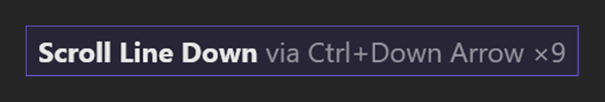
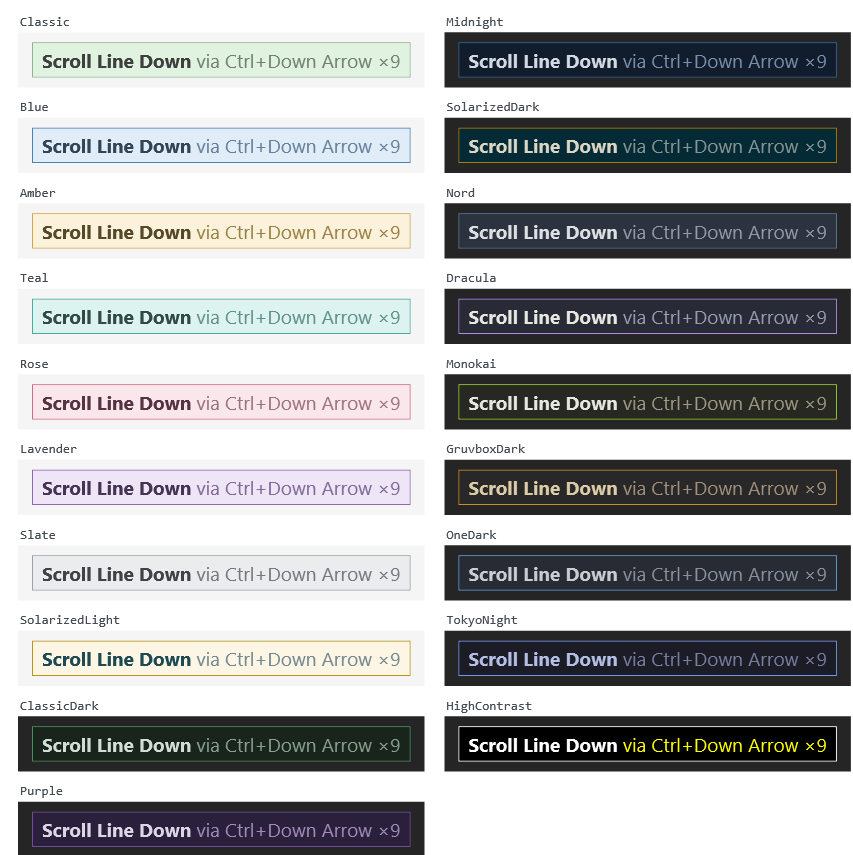
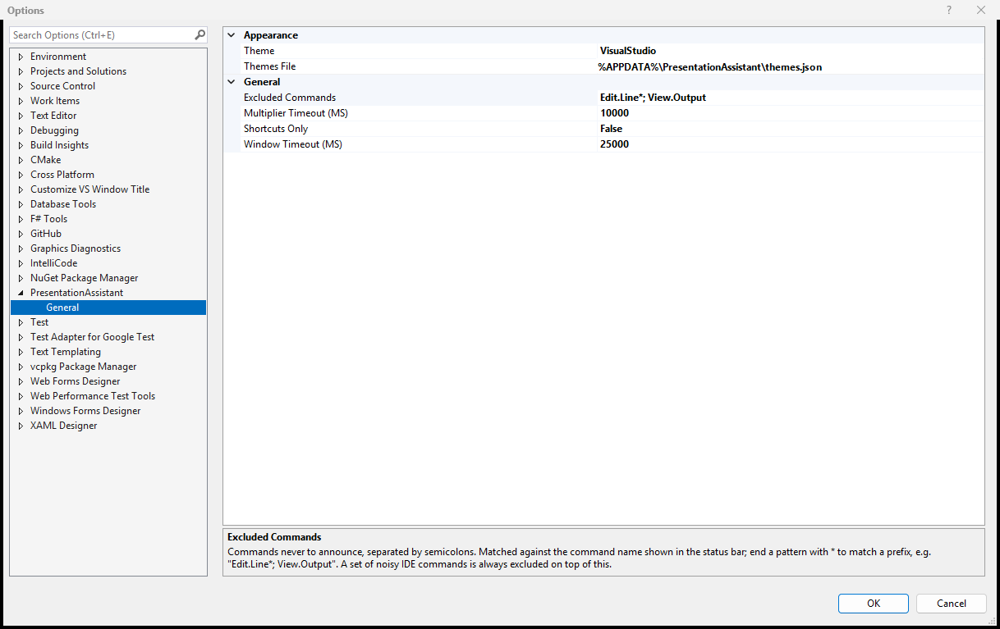

Announces the command you just ran, and the keyboard shortcut that runs it, in a small overlay just above the status bar.

Useful when you are screen sharing, recording a demo, pairing, teaching - or just trying to learn your own key bindings.

## What you see

- The **command name**, in bold. The full command id also goes to the status bar, as `PA: Edit.ScrollLineDown via Ctrl+Down Arrow`.
- Every **key binding** for that command. If there is more than one they are joined with `or`.
- A **repeat count**. Holding a key down, or pressing the same shortcut repeatedly, shows a single line with `x9` rather than flashing nine times. A run ends when you invoke a different command, or after the multiplier timeout.

The overlay never takes focus, never appears in Alt+Tab or the taskbar, is transparent to the mouse so it never swallows a click, and hides itself after a few seconds.

## Themes

The default theme, **VisualStudio**, builds the overlay from the running IDE's own colours - tinted towards your accent so it still reads as a callout instead of disappearing into the chrome - and re-resolves itself whenever you switch theme.

Nineteen fixed palettes come with it, including the original green overlay as **Classic** and its dark counterpart **ClassicDark**, plus Nord, Dracula, Monokai, Gruvbox Dark, One Dark, Tokyo Night and both Solarizeds. Choosing **Auto** gives you the Classic / ClassicDark pair, switching with the IDE.

## Your own colours

The options page has a **Colours** section: click a swatch for a colour picker, or type a value such as `#DCF2DC`, and watch the preview update. It edits whichever theme is selected, and **Reset to built-in** puts it back. The built-in itself is never modified - your version is stored as an entry in `themes.json`.

That file is also editable by hand, if you prefer. An entry adds a theme, or overrides a built-in one when the name matches, and every field except `Name` is optional:

    [
      { "Name": "My Talk", "Background": "#101820", "Border": "#2E86AB", "IsDark": true },
      { "Name": "Amber", "Opacity": 1.0 }
    ]

A generated `themes.reference.json` sits beside it listing every built-in theme in full, so starting from one is copy, paste, tweak. Changes apply on the next keystroke, with no restart.

Overriding `Classic` or `ClassicDark` also changes what `Auto` looks like.

## Options

Under **Tools > Options > PresentationAssistant > General**:

- **Enabled** - turn the overlay off without uninstalling the extension.
- **Theme** - overlay palette, including any you define yourself.
- **Colours** - the four colours and the opacity of the selected theme, with a live preview.
- **Font size** - 8 to 96; the default is 24.
- **Layout** - one line, or the shortcut stacked under the command name.
- **Hide the overlay after** - how long it stays on screen. Default 5000 ms.
- **Count repeats within** - the largest gap between two presses that still count as a repeat. Default 10000 ms.
- **Only announce commands that have a keyboard shortcut**.
- **Excluded Commands** - commands never to announce.
- **Diagnostics** - log to a PresentationAssistant pane in the Output window.

Settings are stored as JSON in `%APPDATA%\PresentationAssistant`, so they survive Visual Studio upgrades and can be copied between machines.

## Excluding commands

Some commands are just noise. List them in **Excluded Commands**, separated by semicolons, with a trailing `*` to match a prefix:

    Edit.Line*; View.Output; File.SaveAll

Patterns match the command id shown in the status bar, and matching is case-insensitive. A set of commands the IDE fires constantly on its own - cursor movement, the debugger's location toolbar, the build configuration dropdowns - is always excluded on top of your list.

## Requirements

Visual Studio 2022 or 2026, 64-bit.

## Links

- [Source code](https://github.com/lokeshgovindu/PresentationAssistant)
- [Release notes](https://github.com/lokeshgovindu/PresentationAssistant/releases)
- [Report an issue](https://github.com/lokeshgovindu/PresentationAssistant/issues)
